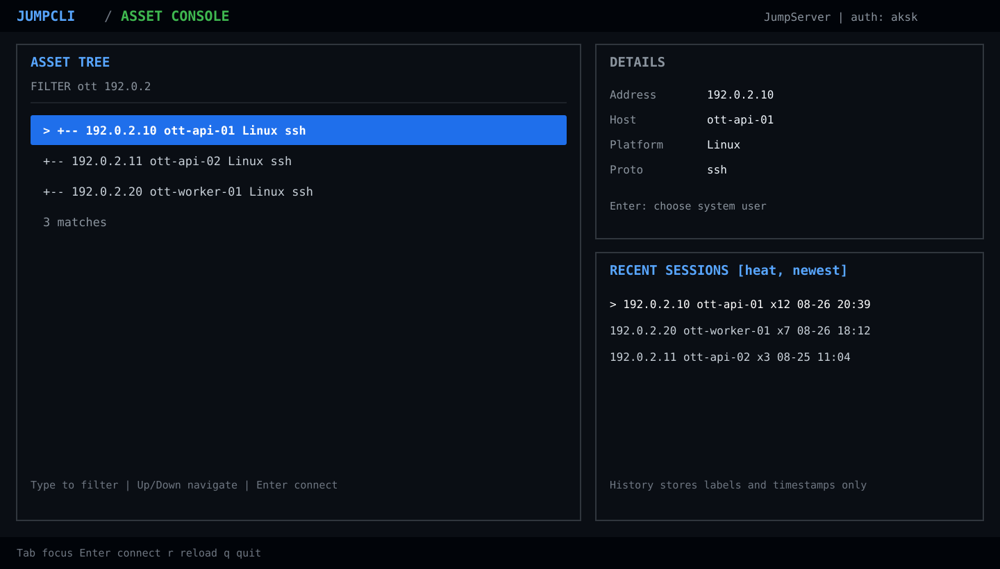

# jumpserver-cli

一个面向 [JumpServer](https://github.com/jumpserver/jumpserver) 的本地 CLI 客户端。
它通过 JumpServer API 获取当前用户已授权的资产和临时 SSH 连接信息，提供命令行参数模式与全屏 TUI 模式。

本项目不会绕过 JumpServer 的认证、授权或审计机制。使用前必须拥有对应 JumpServer 实例、资产和系统用户的访问权限。

## 功能

- 使用 Access Key / Secret 或浏览器 Cookie 认证。
- TUI 资产浏览器：搜索、鼠标点击、键盘导航、系统用户选择。
- TUI 近期会话历史：按连接热度和最近使用时间排序。
- `jssh`：启动交互式 SSH 会话。
- `jexec`：通过 PTY 执行远程命令。
- `jscp`：实验性的 SCP 文件传输入口。
- 临时 SSH Token 本地缓存，减少重复请求。
- 保留脚本化 CLI 参数接口，适合自动化和高级用法。

TUI 预览：



开发和维护 TUI 时，请先阅读 [TUI 开发注意事项](docs/tui-development.md)，其中记录了嵌入式 PTY、渲染性能、输入路由、PS1 清理、会话生命周期和已知回归的处理约束。

运行离线回归测试：

```bash
PYTHONPATH=src python -m unittest discover -s tests -v
```

## 快速开始

### 1. 获取代码

```bash
git clone https://github.com/kinboyw/jumpserver-cli.git
cd jumpserver-cli
```

运行环境要求 Python 3.10+。项目依赖 `prompt-toolkit` 和 `pyte`，推荐使用 [uv](https://docs.astral.sh/uv/) 自动创建环境：

```bash
uv run python jump_cli.py --help
```

不使用 uv 时可以直接运行：

```bash
python3 -m pip install 'prompt-toolkit>=3,<4' 'pyte>=0.8,<1'
python3 jump_cli.py --help
```

建立 SSH 会话还需要系统已安装 `ssh` 和 `sshpass`。
使用 TUI 独立 PTY 和 ZMODEM 传输还需要 `lrzsz` 提供的 `rz` / `sz`。

### 2. 首次启动

直接运行即可开始首次配置：

```bash
./jump_cli.py
```

CLI 会按顺序引导你完成：

1. 输入 JumpServer 根地址。
2. 选择认证方式：Access Key / Secret 或浏览器 Cookie。
3. 输入认证信息并验证连接。

配置成功后，地址会保存到 `~/.config/jumpserver-cli/config.json`，认证信息会保存到本机缓存目录。之后再次运行 `./jump_cli.py` 会直接进入 TUI，不需要重复配置。

推荐使用 Access Key / Secret。也可以在首次启动前手动配置，适用于脚本或非交互终端：

```bash
./jump_cli.py config set --base-url 'https://jumpserver.example.com'
./jump_cli.py login-aksk --key-id 'your-access-key-id'
```

命令会隐藏输入 Secret。也可以只在当前 shell 中提供认证信息：

```bash
export JMS_BASE_URL='https://jumpserver.example.com'
export JMS_ACCESS_KEY_ID='your-access-key-id'
export JMS_ACCESS_KEY_SECRET='your-access-key-secret'
```

查看当前认证状态：

```bash
./jump_cli.py status
```

配置优先级为：命令行 `--base-url` > `JMS_BASE_URL` > 配置文件。

### 3. 启动 TUI

首次启动和后续启动都使用同一个命令：

```bash
./jump_cli.py
```

也可以显式使用：

```bash
./jump_cli.py tui
```

需要在 TUI 内嵌 SSH、使用独立 PTY 和 ZMODEM 时，显式开启 PTY 模式：

```bash
./jump_cli.py tui --pty
```

该选项不会改变默认的外部 SSH 客户端路径。PTY 模式中，SSH 会话直接显示在 TUI 内，普通输入透传到远端；快捷键如下：

| 快捷键 | 操作 |
| --- | --- |
| `Ctrl-X` `U` | 上传本地文件到远端，调用 `sz` / `rz` |
| `Ctrl-X` `D` | 下载远端文件到本地目录，调用 `sz` / `rz` |
| `Ctrl-C` | 中断当前 ZMODEM 传输 |
| `Ctrl-N` | 返回资源树，创建新的 SSH 会话 |
| `F2` | 切换活动 SSH 会话 |
| `F3` | 开关两会话并排视图 |
| 其他 `Ctrl-X` 组合 | 原样发送到远端 |

远端直接运行 `rz` 或 `sz` 后，TUI 会自动识别 ZMODEM 握手并打开文件选择器。文件选择器支持路径输入、目录导航、鼠标点击和上传多选。传输使用二进制和控制字符转义模式（`-be`）。ZMODEM 是否能成功还取决于 JumpServer 网关、目标主机是否安装 `rz` / `sz` 以及远端 shell 是否允许 PTY。传输失败时可以退出 PTY 模式，继续使用默认 TUI 或 `jssh`。

在资源列表中直接输入字符即可检索 IP 或 Hostname。多个条件用空格分隔，所有条件都必须匹配，例如：

```text
ott 10.22
```

常用操作：

| 按键 | 操作 |
| --- | --- |
| `Up` / `Down` | 移动当前列表；过滤时也可直接导航 |
| `Tab` | 在资源列表和近期会话之间切换焦点 |
| 任意字符 | 在资源列表中直接开始检索 |
| `Enter` | 连接当前资源、系统用户或历史会话 |
| `Backspace` | 删除过滤条件中的最后一个字符 |
| `Esc` | 退出过滤、返回资源列表或退出 TUI |
| `r` | 重新加载资源列表 |
| `Ctrl-U` | 清空过滤条件 |
| `Ctrl-C` | 退出 TUI |

鼠标可以点击资源、系统用户和历史会话，也支持滚轮移动列表。

## 基础功能演示

### 首次配置

交互式终端中无需预先创建配置文件：

```console
$ ./jump_cli.py
JumpServer URL: https://jumpserver.example.com
Step 2/2: choose an authentication method.
1. AK/SK (recommended)
2. Browser cookie JSON
Choose auth method [1]: 1
AccessKeyID: your-access-key-id
AccessKeySecret: ********
Org ID [default]:
```

地址和认证信息验证成功后会进入 TUI。后续启动仍然只需要：

```bash
./jump_cli.py
```

### 多条件检索并连接

资源列表获得焦点时直接输入条件，不需要先按 `/`。条件用空格分隔，按 AND 逻辑实时过滤：

```text
ott 192.0.2
```

筛选完成后按 `Enter`，选择系统用户，再按 `Enter` 启动 SSH。只有一个可用的 `ops` 系统用户时会直接连接。

### 解析资源

需要在脚本中确认资源和系统用户时，可以使用 JSON 输出：

```console
$ ./jump_cli.py resolve 192.0.2.10 --system-user ops
{
  "asset": {
    "hostname": "server.example.com",
    "ip": "192.0.2.10",
    "protocols": ["ssh"]
  },
  "system_user": {
    "username": "ops"
  }
}
```

### SSH 和远程命令

```bash
# 交互式 SSH
./jssh 192.0.2.10

# 通过 PTY 执行命令
./jexec 192.0.2.10 -- 'hostname && uptime'
```

客户端会为连接申请短时 Token，并按资源和系统用户缓存。TUI 中获取 Token 的过程不会打印诊断信息；需要排查问题时可以使用普通 CLI 命令查看错误。

### 查看状态和配置

```bash
./jump_cli.py status
./jump_cli.py config show
```

这两个命令不会打印 Secret、Cookie 或临时 Token。

## CLI 用法

### 解析资源和系统用户

```bash
./jump_cli.py resolve 192.0.2.10
./jump_cli.py resolve server.example.com --system-user ops
```

### 连接 SSH

```bash
./jssh 192.0.2.10
./jssh -o ServerAliveInterval=30 192.0.2.10
```

也可以使用主机名：

```bash
./jssh server.example.com
```

### 执行远程命令

命令通过 JumpServer 提供的 PTY shell 执行：

```bash
./jexec 192.0.2.10 -- 'hostname && uptime'
```

涉及 sudo 或高风险操作时需要显式确认：

```bash
./jexec --sudo 192.0.2.10 -- 'id'
./jexec --sudo --yes 192.0.2.10 -- 'systemctl restart nginx'
```

### 查看连接 Token

```bash
./jump_cli.py token 192.0.2.10
```

默认不会显示临时密码。`--show-password` 和 `--print-command` 仅适合本地调试，禁止将输出写入日志或分享。

### 文件传输

```bash
./jscp ./local.txt 192.0.2.10:/tmp/local.txt
```

`jscp` 仍属于实验性功能。JumpServer 网关或目标环境可能要求 PTY，遇到标准 SCP 不兼容时请使用 `jssh` 或 `jexec`。

## 浏览器 Cookie 认证

Access Key / Secret 是推荐方式。需要复用浏览器登录态时，可以使用仓库中的
`tampermonkey-jumpserver-session.user.js`：

1. 在脚本头部将示例 `@match` 改为实际 JumpServer 地址。
2. 在浏览器安装并启用脚本，并登录 JumpServer。
3. 点击页面上的 `Copy JMS Session`。
4. 在终端运行 `./jump_cli.py login`，粘贴 JSON 后回车。

该方式需要浏览器脚本读取 HttpOnly Cookie。Cookie 属于敏感凭据，只应在可信浏览器环境中使用，完成后应及时清理本地缓存。

## 组织 ID

组织 ID 会作为 `X-JMS-ORG` 请求头发送给 JumpServer。单组织实例通常可以使用默认值；多组织账号需要配置当前组织 ID：

```bash
./jump_cli.py config set --org-id 'your-org-id'
```

组织 ID 通常可以从 JumpServer 网页请求的 `X-JMS-ORG` 请求头中查看，也可以向 JumpServer 管理员获取。

可用配置和环境变量：

| 配置/变量 | 说明 |
| --- | --- |
| `--base-url` / `JMS_BASE_URL` | JumpServer 根地址 |
| `--org-id` / `JMS_ORG_ID` | 组织 ID |
| `JMS_CONFIG_FILE` | 自定义非敏感配置文件路径 |
| `JMS_ACCESS_KEY_ID` | Access Key ID |
| `JMS_ACCESS_KEY_SECRET` | Access Key Secret |
| `JMS_TOKEN_CACHE_TTL` | Token 缓存时间，默认 600 秒 |
| `JMS_TOKEN_REFRESH_COOLDOWN` | Token 刷新冷却时间，默认 30 秒 |
| `JMS_TOKEN_CACHE_DISABLE=1` | 禁用 Token 缓存 |

## 本地文件和安全

认证和临时连接数据默认位于：

- 配置：`~/.config/jumpserver-cli/config.json`
- 凭据：`~/.cache/jumpserver-cli/credentials.json`
- Cookie：`~/.cache/jumpserver-cli/cookies.txt`
- Token：`~/.cache/jumpserver-cli/tokens.json`
- 会话历史：`~/.local/state/jumpserver-cli/history.json`

会话历史只保存资源和系统用户的显示信息、连接次数及时间戳，不保存 Cookie、密码或 Token。凭据、Cookie 和 Token 不得提交到 Git、写入脚本、日志、工单或聊天记录。

清理本地认证缓存：

```bash
rm -rf "$HOME/.cache/jumpserver-cli"
```

怀疑凭据泄露时，应立即删除本地缓存，并在 JumpServer 中注销会话或轮换 Access Key。

## 故障排查

### 认证失败或返回 401/403

确认 JumpServer 地址正确，Access Key 具备资产查询和连接 Token 权限；Cookie 认证则重新执行 `login`。

### 找不到资源

确认当前账号已获得资产授权，并使用完整 IP 或 Hostname 搜索。可以先执行：

```bash
./jump_cli.py status --probe --probe-search 127.0.0.1
```

### `sshpass is required`

安装系统对应的 `sshpass` 软件包。仅查询资源和 Token 不需要它，建立 SSH 会话时需要。

### SSH 返回 255

客户端会尝试刷新一次过期 Token。仍然失败时，检查 JumpServer 网关、目标资产网络和系统用户授权。

## 开发

源码位于 `src/jumpserver_cli/`，根目录脚本用于直接运行源码。本项目使用标准库和 `prompt-toolkit`。

本地自检：

```bash
python3 -B -m py_compile jump_cli.py jssh jexec jscp src/jumpserver_cli/*.py
uv lock --check
python3 jump_cli.py --help
```

请只在获得明确授权的 JumpServer 实例和资产上进行测试。

## License

当前仓库尚未指定开源许可证。若要公开发布，请在仓库根目录补充 `LICENSE` 文件，并选择适合项目的许可证。
